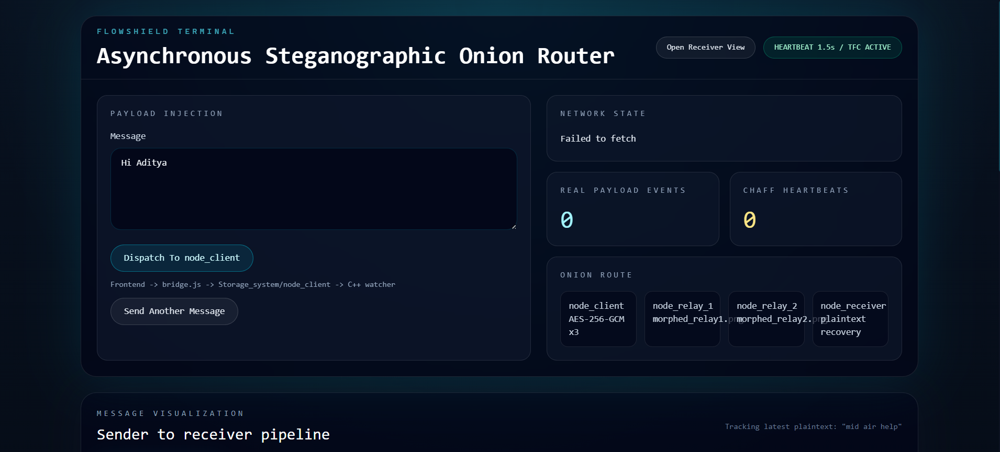
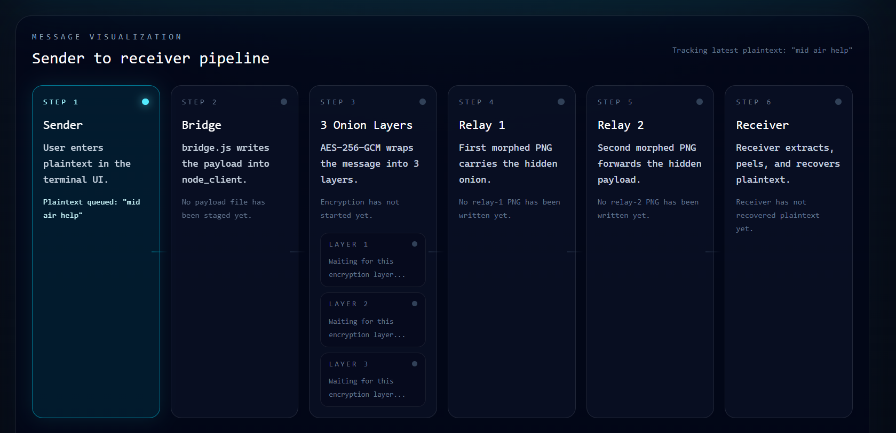
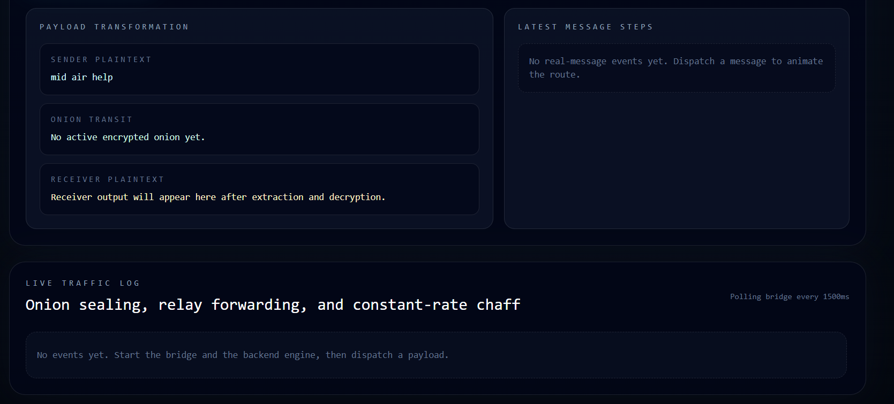
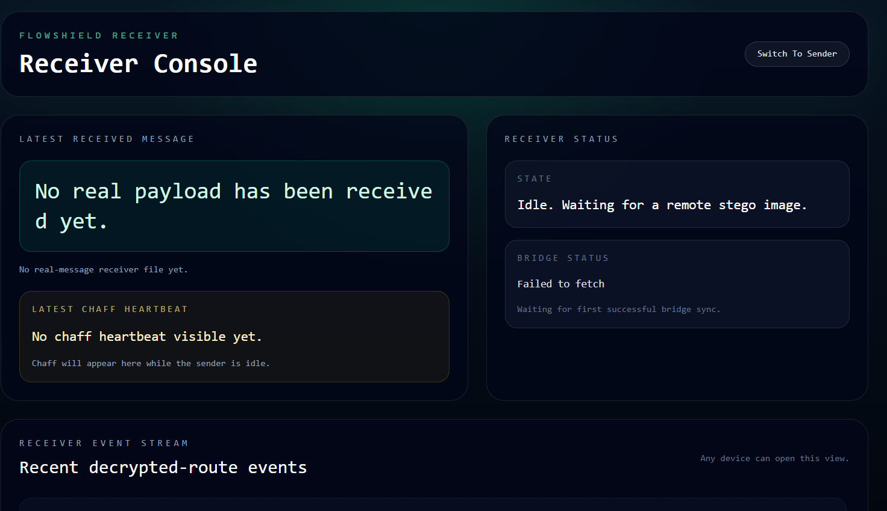

# FlowShield

FlowShield is an asynchronous steganographic onion router demo. It combines a C++ backend, a React dashboard, and lightweight Node.js bridge services to show how plaintext can be wrapped in multiple encryption layers, hidden inside PNG images, forwarded through relay folders, and recovered at the receiver while background chaff traffic keeps the channel noisy.

## Overview

- React frontend for sender and receiver dashboards
- Node.js bridge API for message staging and traffic polling
- Node.js receiver service for remote relay delivery
- C++ engine for file watching, encryption, steganography, and recovery
- Shared storage directories that simulate the route between client, relays, and receiver

## Architecture

```text
Sender UI
  -> Frontend bridge API (`Frontend/Frontend/bridge.js`)
  -> `Storage_system/node_client`
  -> C++ FlowShield engine (`Backend/flowshield.exe`)
  -> `Storage_system/node_relay_1`
  -> `Storage_system/node_relay_2`
  -> receiver service (`Frontend/Frontend/receiver-server.js`) or local receiver flow
  -> `Storage_system/node_receiver`
  -> frontend receiver view
```

## Repository Structure

```text
Flowshield/
|-- Backend/
|   |-- Source/              # C++ engine sources
|   |-- Include/             # constants and headers
|   |-- assets/covers/       # PNG cover-image pool
|   `-- flowshield.exe       # compiled backend executable
|-- Frontend/Frontend/
|   |-- src/                 # React app
|   |-- bridge.js            # bridge API service
|   |-- receiver-server.js   # receiver service
|   `-- package.json
|-- Storage_system/
|   |-- node_client/
|   |-- node_relay_1/
|   |-- node_relay_2/
|   |-- node_receiver/
|   `-- traffic_log.jsonl
|-- image.png
|-- image-1.png
`-- README.md
```

## Core Flow

1. The sender types a plaintext message into the React dashboard.
2. The bridge writes a `payload_<timestamp>.txt` file into `Storage_system/node_client`.
3. The C++ engine watches that folder and starts processing the payload.
4. The message is wrapped in 3 onion layers and hidden inside morphed PNG relay files.
5. Relay output moves through `node_relay_1` and `node_relay_2`.
6. The receiver service or local receiver mode extracts and decrypts the final payload.
7. The frontend polls the bridge every 1500 ms to animate the route and show logs.

## Tech Stack

- Frontend: React 19, Vite, Tailwind-based styling
- Bridge services: Node.js, Express, CORS
- Backend engine: C++
- Data flow: filesystem-based relay simulation plus optional HTTP receiver forwarding

## Prerequisites

- Node.js 18 or newer
- npm
- Windows-compatible `Backend/flowshield.exe` for the full backend flow

## Running Locally

Open separate terminals as needed.

### 1. Start The Bridge

From `Frontend/Frontend`:

```bash
npm install
npm run bridge
```

This starts the bridge API using the default port currently configured in the project.

### 2. Start The Frontend

From `Frontend/Frontend`:

```bash
npm run dev
```

### 3. Start The Receiver Service

From `Frontend/Frontend`:

```bash
npm run receiver
```

This starts the receiver service using its configured default port.

### 4. Start The Backend Engine

From `Backend`:

```bash
./flowshield.exe
```

The backend watches `Storage_system/node_client` and processes new payload files.

## Frontend Scripts

From `Frontend/Frontend`:

- `npm run dev` starts the Vite app
- `npm run build` builds the frontend
- `npm run preview` previews the production build
- `npm run lint` runs ESLint
- `npm run bridge` starts the bridge API
- `npm run receiver` starts the receiver server

## Service Configuration

- The bridge service port is defined in `Frontend/Frontend/bridge.js`.
- The receiver service port is defined in `Frontend/Frontend/receiver-server.js`.
- The frontend uses the current browser hostname together with the bridge configuration.
- If you change ports, update the related service and client settings together.

## Important Paths

- `Storage_system/node_client` stores sender payload files
- `Storage_system/node_relay_1` stores first relay PNG outputs
- `Storage_system/node_relay_2` stores second relay PNG outputs
- `Storage_system/node_receiver` stores recovered plaintext
- `Storage_system/traffic_log.jsonl` stores recent event history

## Receiver Forwarding

To forward relay-2 images to another machine, set this environment variable before starting the bridge:

```bash
FLOWSHIELD_RECEIVER_URL=http://<receiver-host>:<receiver-port>/api/receive-stego
```

If this variable is not set, the bridge stays in local-only mode.

## Notes

- The backend constants currently use a `1500 ms` heartbeat interval.
- The default demo message in the backend constants is `Hi Aditya`.
- The receiver service expects the backend executable at `Backend/flowshield.exe`.
- The bridge and UI derive their behavior from the shared `Storage_system` folders, so those directories should remain available.

## Screenshots

### Dashboard Overview



### Pipeline Visualization



### Payload Transformation And Traffic Log



